# Windsurf Racing Timer & Tracker

A specialized Garmin Connect IQ application designed for **windsurfing, foiling, wing slalom, course racing, and training sessions**. Built exclusively for Garmin watches with a **5-button layout**, the app provides precise start-line timing, automatic tack detection, and comprehensive session analytics — all optimized for the demands of racing on the water.

---

## Table of Contents

- [Core Features](#core-features)
- [Supported Devices & Screen Layouts](#supported-devices--screen-layouts)
- [Menu Structure](#menu-structure)
  - [1. Timer](#1-timer)
  - [2. Practice (Tracker View)](#2-practice-tracker-view)
  - [3. Markers Menu](#3-markers-menu)
  - [4. Setup Menu](#4-setup-menu)
  - [5. GPS Status](#5-gps-status)
  - [6. Gear Menu](#6-gear-menu)
  - [7. Quit](#7-quit)
- [Session Summary](#session-summary)
- [Screenshots](#screenshots)
- [Changelog](#changelog)
- [Installation](#installation)

---

---

## Core Features

| Feature | Description |
|---|---|
| **Target Sport** | Windsurfing, Foiling, Wing Slalom, Course Racing, and practicing |
| **Button-Only Control** | All navigation is done exclusively with physical buttons — wet hands won't interfere with operating the app on the water |
| **Unified Timer + Tracker** | Start timer and practice tracker live in one application, so activity recording is never interrupted when switching between modes |
| **On-Water Tack & Jybe Analysis** | Maximum speed on the previous tack and minimum speed during a jybe are shown right after the maneuver — and the full tack history can be reviewed directly on the water |
| **Fully Customizable** | A wide range of setup options let you tailor the app's behavior to your own preferences |
| **Start Line Prediction** | Calculates your time to the start line and tells you whether to speed up or slow down |
| **Jybe Hints** | Vibration-guided maneuvers that deliver you to the start line exactly on time |
| **Gear & Impressions in FIT** | Equipment database and session impressions are recorded into the `.fit` file |
| **Start Line in FIT** | Saved start line points are recorded into the `.fit` file and remain available for post-session analysis |
| **Activity Recording** | Starts automatically on application launch upon the **first stable GPS fix** |
| **Session Handling** | Saved or discarded via an exit dialog upon quitting |
| **Typography** | Dynamic Vector Font handling with custom 7-segment display fallback |
| **Precision Timing** | Millisecond-based timer accuracy; no drift on multiple time syncs |

---

## Supported Devices & Screen Layouts

The app supports **over 96 models** — all modern round and semi-octagon screens with 5 physical buttons. It features completely unique, highly optimized layouts for each of the following resolutions to maximize font sizes for crucial metrics (seconds, speeds).

| Resolution | Layout Type | Notes |
|---|---|---|
| **454 × 454** | Round | Increased timer seconds font size (v3.8) |
| **416 × 416** | Round | Added in v5.3 |
| **280 × 280** | Round | — |
| **260 × 260** | Round | Vector font and non-vector font variants handled separately |
| **240 × 240** | Round | — |
| **176 × 176** | Semi-octagon | — |

> **Typography Note:** The app dynamically handles **Vector Font availability**. For instance, on 260×260 screens, some devices have vector fonts (e.g., Forerunner 955) while others do not (e.g., Fenix 6). On devices lacking vector fonts, the app automatically utilizes a custom, **arbitrary-sized 7-segment display** for the timer digits to ensure perfect readability.

---

## Menu Structure

Upon launching, the user sees a main menu with **7 items**. Each section is detailed below.

---

### 1. Timer

The **Timer** is both a standard countdown timer and a full-featured **start procedure computer**. Beyond the classic regatta countdown, it helps you execute the entire start sequence using two intelligent assistants:

- **Start Line Prediction** — calculates your time to the start line and tells you whether to speed up or slow down.
- **Jybe Hints** — vibrates at the right moments to guide you through maneuvers and deliver you to the line exactly on time.

Together, these features turn the Timer into a complete virtual coach for the start.

Basic timer view on Fenix 8 Pro

Here on screen: 
 - **Biggest numbers** are seconds 
 - 07 indicates seven minutes to start
 - 00:00 current session duration
 - 14:29 current time
 - 7 in the righ bottom indicates current timer program
 - circle indicates if timer start automatically after 00:00 (looped)
 - Pins: 1 means only one marker of start line is set. Prediction require 2 markers.

**Controls:**

| Button | Action |
|---|---|
| **Left Middle** | Start / Pause timer |
| **Left Bottom** | Reset to default setup minutes |
| **Right Upper** | Sync seconds to zero (round to nearest minute) |
| **Right Bottom** | Return to main menu |

**Audio / Vibration:**
- Beeper and vibration alerts inspired by **Optimum Time Series** yachting watches.
- Controlled via two separate toggles in the **Setup** menu:
  - **Timer beeper** — On / Off
  - **Timer vibrate** — On / Off

**Timer Program Configuration:**
- Configured in the **Setup** menu:
  - **Timer program** — countdown duration from **2 to 12 minutes**
  - **Timer loop** — On / Off (looping the countdown, useful for training sessions)

**Auto-Switching Logic:**
- In **non-loop mode**, 5 seconds after reaching zero, if current speed exceeds the threshold (**default 30 km/h**), the app automatically switches to the **Practice View**.
- If the user crashes or stalls and speed drops below the lower threshold (**default 10 km/h**), the app automatically switches **back to the Timer screen**.

#### Start Line Prediction

The start line prediction is one of the app's most powerful features for racing. It is controlled in the **Setup** menu via the **Timer predict interval** parameter — the number of seconds before the start at which the prediction should be enabled (**0 to 90**).

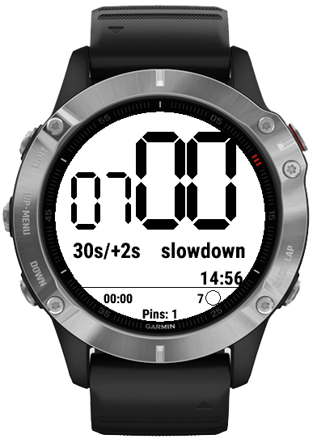

This is artificially made situation, just to get you an idea on how it looks on the start.

**How it works:**

1. Save the **Boat** and **Pin** positions of the start line in the **Markers** menu.
2. Once the timer countdown reaches the configured **Timer predict interval** (e.g., 30 seconds before start), the prediction becomes active.
3. The watch uses your **current position**, **speed**, and **course** to calculate the **time to cross the start line** defined by the saved Boat and Pin.
4. The screen then shows:
   - **Predicted time** to the start line
   - **Discrepancy** between the predicted time and the timer value
   - A **hint** indicating whether you should **speed up** or **slow down**

> **GPS Precision Note:** GPS has a ~3-meter dispersion. If you start at lower speeds (for course racing and yachts), this may result in 1–2 seconds of error in predictions. Adding more pins increases pin coordinate accuracy as it averages the coordinates.

#### Jybe & Start Zone Hints

The timer also helps you time your maneuvers and approach the start line correctly. This is done through a combination of **vibration alerts** and **calculations** based on the **Jybe seconds** and **Start zone** parameters in the Setup menu.

**How it works:**

- The watch **vibrates when you cross the start line**.
- After that, the watch **vibrates again when it's time to begin your jybe/tack maneuver**.
- The algorithm is driven by two Setup parameters:
  - **Jybe seconds** — how much time to allocate for performing the maneuver (e.g., 15 seconds).
  - **Start zone** — how much space from the start line you need to sail on a straight course, specified in **seconds** (e.g., 30 seconds).

**Example:**
> With **Jybe seconds = 15** and **Start zone = 30**, the watch will guide you so that you arrive at a point from which the distance to the start line equals **30 seconds**, exactly **30 seconds before the start**. The calculation is based on your **current position** and **speed**, and it updates dynamically.

This provides a reliable countdown sequence:
1. Timer crosses the configured interval → prediction starts.
2. Vibration signals when to begin the jybe/tack.
3. Vibration signals when the start line is crossed.
4. Continuous hinting (speed up / slow down) to hit the line exactly on time.

#### Timer Screenshots

<!-- Add your Timer screenshots here for each resolution and font variant -->

**Round 454 × 454**

**Round 416 × 416**

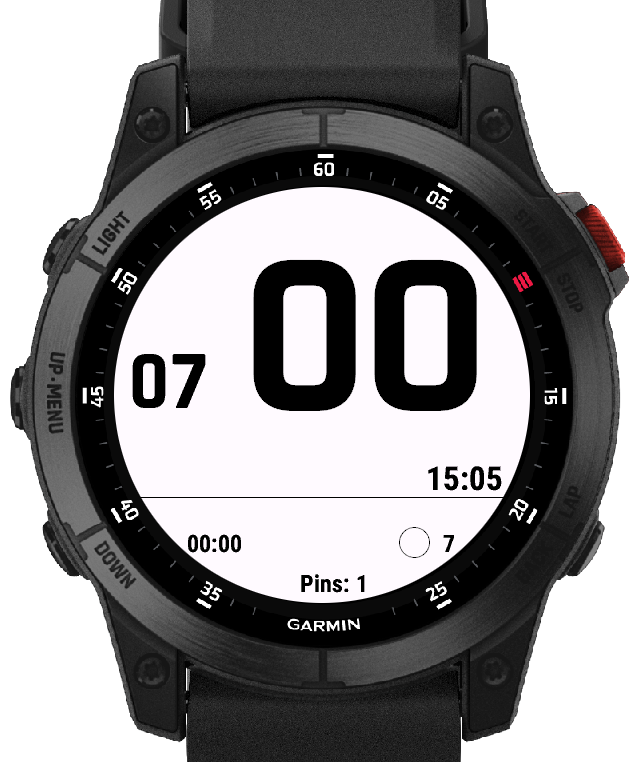

**Round 280 × 280**

**Round 260 × 260 — Vector Font (e.g., Forerunner 955)**

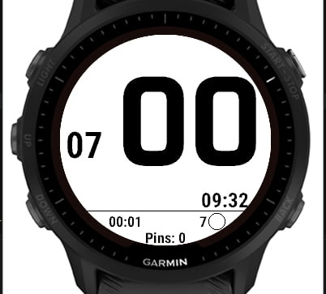

**Round 260 × 260 — Non-Vector Font / 7-Segment (e.g., Fenix 6)**

**Round 240 × 240**

**Semi-octagon 176 × 176**

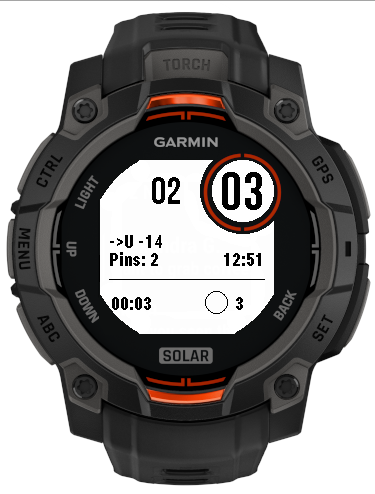

---

---

## 2. Practice (Tracker View)

The Practice view is the core training screen, displaying real-time metrics and automatic tack logging. Its main purpose is to let you **analyze speeds and rig/gear settings right on the water** — without needing to go ashore for a phone or computer.
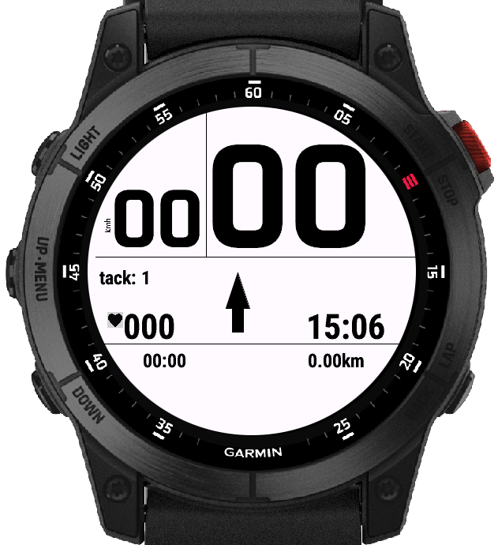

### Displays

- Current speed top left
- Session distance travelled
- Current heart rate
- Current local time
- Maximum **2-second average speed** for the previous tack on the top right
- **Direction arrow to Home** (if a Home point has been set in the Markers menu)

### Tack Detection & Navigation

- Tacks are detected automatically.
- **Up/Down buttons** step through the tacks history.
- **Right Upper button** returns to the active (current) leg.
- Arrows indicate **current heading** and **average heading** — used internally to control tack detection.

### Jybe Speed Analysis

- Currently available **only on 260×260 devices** and is being tested by an athlete.
- The parameter is displayed **after every maneuver** and can be reviewed in the **tacks history** — not only after the session.
- This allows you to evaluate jybe performance instantly, on the water, and adjust your technique or gear on the fly.

### Session Summary Popup

Pressing the **Right Upper button** while tracking brings up a universal overlay with the following metrics:

- **Peak speed**
- **2s speed**
- **100m speed**
- **Distance**
- **Duration**
- **Max heart beat**
- **Calories burned**

Pressing **Right Bottom (Back)** always closes the summary and returns to the current tack display.

### Practice Screenshots

<!-- Add your Practice screenshots here for each resolution and font variant -->

**Round 454 × 454**

**Round 416 × 416**

**Round 280 × 280**

**Round 260 × 260 — Vector Font (e.g., Forerunner 955)**

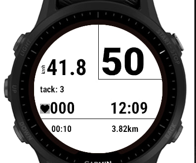

**Round 260 × 260 — Non-Vector Font / 7-Segment (e.g., Fenix 6)**

**Round 240 × 240**

**Semi-octagon 176 × 176**

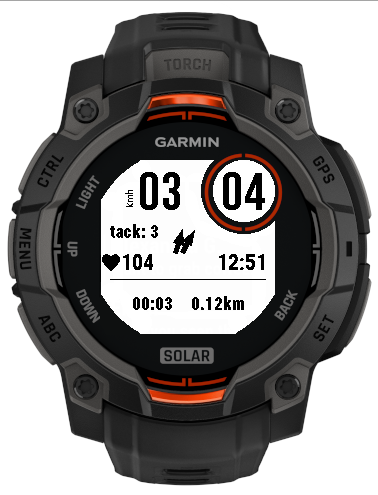

---

---

## 3. Markers Menu

The Markers menu replaces the older "Pins" menu (reworked in v5.4) and uses standard sailing/regatta terminology. It features a **smart GPS averaging algorithm** to defeat GPS drift (~3-meter dispersion).
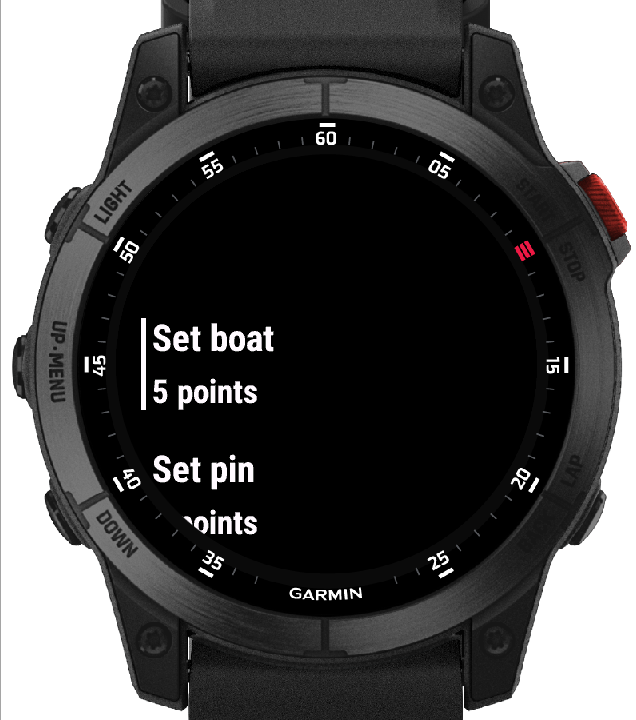

### Menu Structure

| Item | Actions |
|---|---|
| **Set boat** | Set / Reset |
| **Set pin** | Set / Reset |
| **Set home** | Set |
| **List** | Review stored markers |

### Smart Averaging

- Under **Set boat** and **Set pin**, the app displays the number of recorded points.
- If a new point is within a **10-meter radius** of the previous one, coordinates are **averaged together** to achieve high pinpoint precision at low speeds.

### Set Home

- Saves the launch/beach location.
- When a Home point is set in the Markers menu, the **Practice View** displays a **direction arrow pointing to Home**.
- The **GPS Status view** shows the exact distance to Home.

### List & Reset

- **List** reviews stored marker data.
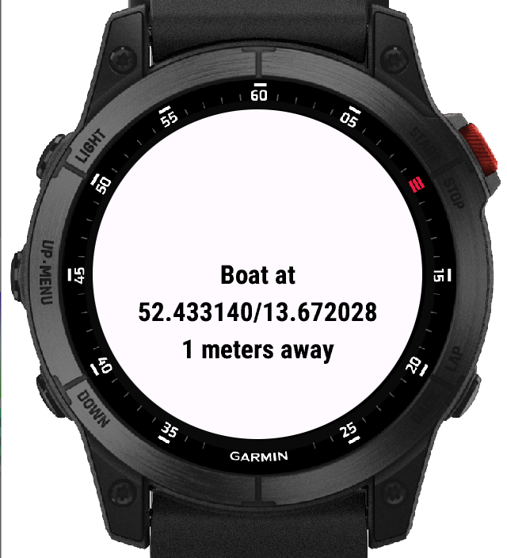

> **Note:** Pin locations are saved directly to the `.fit` file for further post-session analysis.

---

## 4. Setup Menu

The Setup menu allows full customization of units, display, timer behavior, and alert preferences.

| Setting | Options |
|---|---|
| **Speed Units** | km/h or knots |
| **Distance Units** | kilometers or sea miles |
| **Color Theme** | Black or White background |
| **Timer program** | Countdown duration from **2 to 12 minutes** |
| **Timer loop** | On / Off (looping countdown, useful for training sessions) |
| **Timer beeper** | On / Off (audio alerts for start timer) |
| **Timer vibrate** | On / Off (vibration alerts for start timer) |
| **Timer threshold speed** | Speed to switch from Timer → Practice |
| **Tracker threshold speed** | Speed to switch from Practice → Timer |
| **Tracker autostart** | On / Off (default: **Off**) — automatically switch to the Practice view when activity is detected |
| **Timer predict interval** | Seconds before start to show prediction info (**0 to 90**) |
| **Jybe seconds** | Time allocated for performing a jybe/tack maneuver (used for start hints) |
| **Start zone** | Distance (in seconds) from the start line to sail on a straight course |
| **Save doppler speed** | On / Off — save raw Doppler speed data to the `.fit` file for post-session analysis |

---

## 5. GPS Status

Displays current GPS quality and accuracy along with additional telemetry.
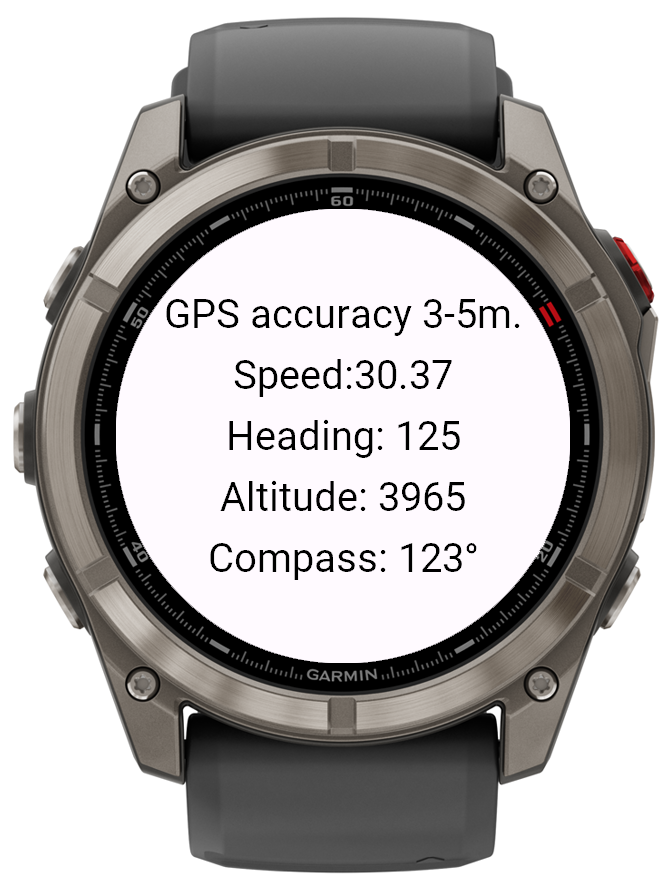

### Displays

- GPS quality
- Precision accuracy
- Speed
- Heading
- Altitude
- **Distance to Home** (if a Home point has been set in the Markers menu)

### Compass Fallback

- Uses the **magnetic compass** if stationary or if GPS signal is temporarily lost.
- Heading is normalized to the **0–359 range**.

---

## 6. Gear Menu

The Gear menu lets you record equipment used and environmental conditions for each session.
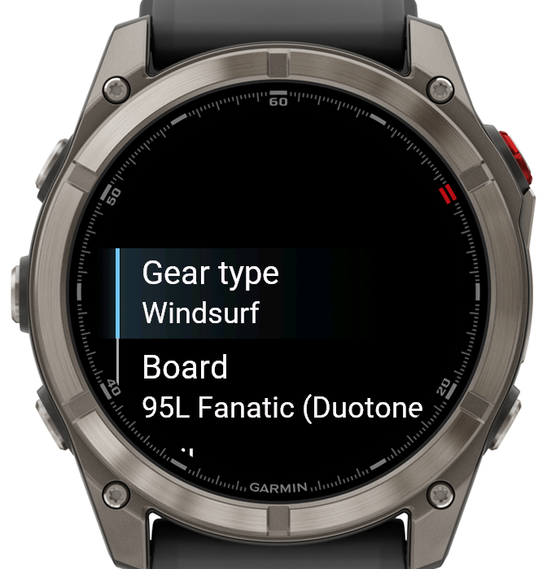

### Equipment DB

- Select **Board**, **Sail**, **Fin**, **Wing Board**, **Wing Foil**, or **Wind Foil**.
- Stored directly in the **FIT activity summary** for review.
- Database was generated using AI and is certainly incomplete — please report missing records.
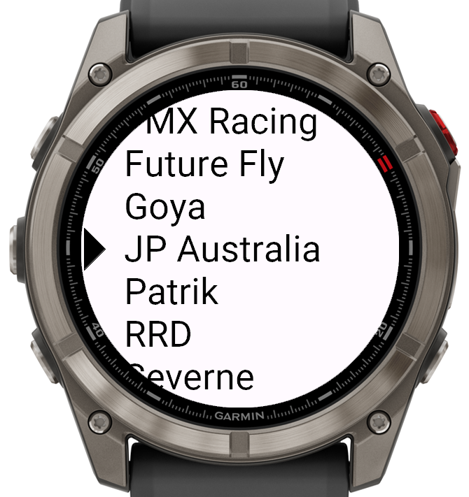

### Environment & Impressions

- **Windspeed** logging
- **Wind Match** — how well the conditions matched your setup
- **Ride Comfort** — subjective comfort rating

---

## 7. Quit

Triggers a safe exit sequence.

### Exit Dialog

- **Save / Discard** activity dialog appears on exit.

### Anti-Accident Protection

- Pressing **Right Bottom (Back)** on this screen acts as an **Undo** command — immediately returning to the active session **without data loss**.
- This is useful if you fall off unintentionally and want to continue your training.

---

## Session Summary

After the session ends, a summary is shown. The same summary can be accessed during the activity via the **Right Upper button** in the Practice view.
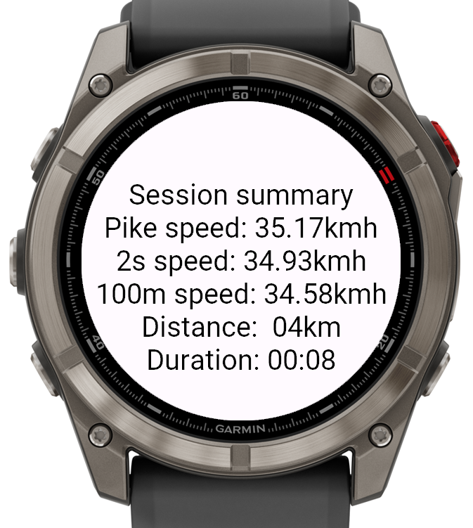

### Metrics Included

- Peak speed
- 2-second speed
- 100m best speed
- Distance
- Duration
- Max heart beat
- Calories burned

---

## Installation

1. Ensure your Garmin watch is compatible (5-button layout, one of the supported resolutions).
2. Download the app from the **Garmin Connect IQ Store**.
3. Install via **Garmin Express** or the **Connect IQ app** on your phone.
4. Launch the app from your watch's activity menu.
5. The app will automatically start recording upon the **first stable GPS fix**.

---

## License

This project is provided as-is for personal use. Please report any issues or missing gear database records via the project's issue tracker.

---

*Built for sailors, by sailors. Fair winds and fast tacks!* ⛵
